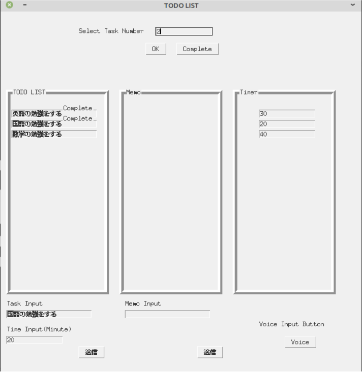

# TODO LIST

音声入力と制限時間付きタスク管理アプリです。

# 機能

タスクとタスクに費やす時間を音声入力できる機能です。キーボード操作もできます。またタイマー機能も追加したので常に締切りに追われる気分でタスクをこなせると思います。

# 実行結果

起動時は以下のGUIウィンドウが起動します。

タスクをキーボード入力して送信ボタンを押すと以下の画面になります。

Select Task Numberでタスクの番号を入力するとタイマーが表示されます。

音声操作の手順はVoceボタンを押して、タスク名 時間 の順にマイクに向かって話すと認識してくれます。次の画像の例は「数学の勉強をする」「40」とマイクに向かって話しかけた結果です。

完了したタスクはCompleteボタンを押すことで完了済みということになります。

# 追加するべき機能

タスクの削除ボタン、細かなエラー(Time Inputで文字列を入力した場合)処理を実装していきたい。
